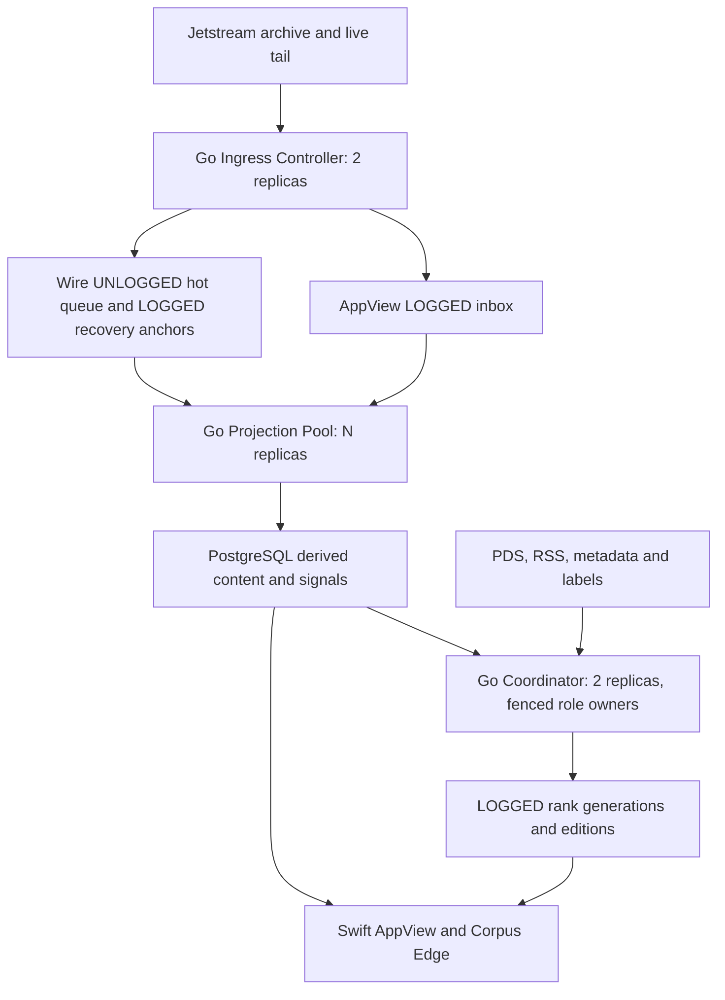

# Go migration: ingestion and ranking

Status: background Go runtime implemented; worker source retirement follows exact Development acceptance. Original plan prepared October 5, 2026. Production promotion remains separate.

Current runtime: `services/indexing-worker` composes `packages/go/appviewworkercore` and `wireworkercore`, with role fencing and independent lane supervision. Superseded worker-only Swift source and jobs are retired; shared Swift serving packages and domain parity oracles remain. The scope table and estimates below preserve the original migration plan. Rollback restores a previously accepted Git revision, not deleted compatibility targets.

Repository baseline: `f30f99f194c5410dae255f84e76177c053758546`.
This plan reflects inspected source and existing Linear work; live Railway
configuration, enabled modes, throughput, and resource usage have not been verified.

## Recommendation

Treat this as one coordinated migration of the background data plane. Retain
the three existing service classes: Go Ingress Controller, replicated Projection
Pool, and fenced Coordinator. Port the latter two to Go while keeping their
PostgreSQL contracts compatible with the Swift workers and serving services.

Replicate all repository-owned shared packages in Go as part of the migration
program, including packages whose consumers are outside the background pipeline.
Keep their implementations, tests and build wiring in this repository under
`packages/go`. Package parity is a deliverable even when its serving consumer
continues to run Swift; deployment scope and package implementation scope are
tracked separately.

The existing inbox and materialization boundaries make migrating most ingestion
and ranking together plausible. Build and validate the replacement as one
program, then hand off authoritative ownership by lane and role in Development
before Production. A single simultaneous switch of every writer would obscure
failures and make rollback harder without reducing the implementation work.

The recommended service cutover scope is the full background pipeline. The user
has confirmed that all shared packages must also have repository-local Go
counterparts. Whether to switch ranking used by serving paths remains a separate
decision. No architectural choice here authorizes deployment.

## Current implementation and proposed scope

| Component | Current source | Proposed treatment |
| --- | --- | --- |
| Jetstream intake, replay, admission, checkpoints | `services/jetstream-ingest` (Go) | Reuse; adjust only integration/configuration needed for new consumers |
| AppView projection and repository repair | `JetstreamInboxProjectionWorker`, `ThinAppViewIndexer`, `ThinAppViewProjectionRepairJob` in `ThinAppViewCore` | Port event application, scope checks, claim/ack, lifecycle handling and repairs |
| Wire projection | `PostgresWireInboxProcessor`, repository claims/drain in `WireWorkerCore` | Port admission-dependent projection, ordered retractions, aliases, signals, recommendations, feedback and recovery |
| AppView background jobs | `ThinAppViewWorkerRuntime` and role plan | Port RSS polling/parsing, proactive PDS backfill, retention and recovery for supported modes |
| Wire materialization | `WireWorkerCycle`, `PostgresWireGenerationStore`, `WireRankingScheduler`, `WireRanker` | Port candidate loading, ranking, locale/regional editions, fenced atomic publication and generation cleanup |
| Wire enrichment and graph jobs | `WireWorkerHost` and maintenance/hydration runtimes | Port metadata, labels, profiles, graph maintenance, recommendation hydration/recovery and disposable cache maintenance |
| Finance and Sports | Projectors and materializers under `WireWorkerCore` | Include active background responsibilities; preserve existing enablement and Finance rights gates |
| Shared runtime/control | `IndexingWorkerRuntime`, `OperationsCore` leases and telemetry | Port lease protocol, supervision, cancellation, health evidence and Operations-compatible reporting |
| AppView/Corpus Edge fallback ranking | `PostgresWireFeedStore`, `PostgresWireCorpusStore` | Remains Swift in recommended scope; requires parity with Go materialization |
| Circle ranking | `CircleDiscoveryService`, `CircleRanker` | Port shared ranking to Go with WireCore parity; switching AppView's caller remains a separate serving decision |
| Request-triggered ingestion/enrollment | AppView serving and shared `ThinAppViewCore` | Inventory before promising all ingestion; retain existing request behavior unless explicitly included |

Background role consolidation is already implemented ([TSW-79](https://linear.app/stygian-tech/issue/TSW-79/consolidate-ingestion-and-indexing-into-replicated-service-classes)).
The Go migration should build on it. Existing Swift libraries remain needed by
serving and rollback even after the background executables are retired.
Historical Tap/legacy subscriber branches should be classified as active,
rollback-only, or retired before implementation; do not revive retired authorities
or silently drop a supported mode.

## Target architecture

Shared Go code belongs under `packages/go`, accessible to multiple services
rather than hidden in ingress's `internal` tree. Preserve recognizable domain
boundaries and use idiomatic Go APIs with equivalent behavior. Projection and
coordinator entrypoints stay service-owned, with independent builds and deployment
roles. Reusable counterparts of `AppViewWorkerCore`, `WireWorkerCore`, and
`IndexingWorkerCore` should use these shared packages without copying domain code.

Recommended module arrangement: one repository-local shared module rooted at
`packages/go`, imported by service modules through relative `replace` directives.
A root `go.work` may simplify development, but service builds and CI must also
resolve local imports with `GOWORK=off`. Docker builds use the monorepo context
and copy the shared module before building a service. Shared changes must trigger
tests/builds for every dependent Go service. Module import paths identify source;
they do not require publishing or fetching our shared code from another repository.

Use the pinned Go toolchain and pgx approach already used by ingress; evaluate
RSS, HTML and Redis libraries against fixtures before selecting them. Preserve
package-level contracts for supported stores and transports. Do not introduce
a new broker or ORM as part of the language port.

## Repository-local package parity

The initial manifest inventory contains eight shared Swift packages and three
top-level TypeScript/schema packages. Every one needs an explicit Go parity entry;
package 0 must discover any additional repository-owned packages and reusable
service libraries. Existing Swift/TypeScript implementations remain available
for their current consumers and differential verification.

| Existing package | Planned Go package under `packages/go` | Parity scope |
| --- | --- | --- |
| `WireCore` | `wirecore` | Models, data policy, actor hashing, Wire/Circle/regional rankers, quality rules and deterministic output |
| `ThinAppViewCore` | `thinappviewcore` | Projection, indexing, RSS, enrollment/backfill, recovery, store/cache contracts and supported implementations |
| `OperationsCore` | `operationscore` | Control models, leases/fencing, recovery/control contracts, health evidence, telemetry and supported stores |
| `ReadStateCore` | `readstatecore` | Read-state identities, validation, merge/projection rules and protocol behavior |
| `SocialWireRedis` | `socialwireredis` | Key namespaces, serialization, TTLs, cache behavior, connection/security configuration and failure handling |
| `FinanceCore` | `financecore` | Models, catalogs, policies, ranking/materialization inputs and feature/rights constraints |
| `SportsCore` | `sportscore` | Models, catalogs, policies, ranking/materialization inputs and provider contracts |
| `GatewayCore` | `gatewaycore` | Repository-owned gateway behavior and equivalent auth/trust interfaces, even before a Gateway service cutover |
| `packages/read-state` | `readstate` | Versioned protocol, validation, repository/outbox/GC behavior and shared fixtures; browser IndexedDB remains a client adapter, with an equivalent Go persistence interface |
| `packages/lexicons` | `lexicons` | Go models/validation generated or derived from the existing canonical lexicon JSON, plus drift/conformance tests |
| `packages/spec` | `spec` | Go-accessible API/endpoint contracts and corresponding contract checks derived from canonical OpenAPI/manifest sources |

Keep schema sources and shared fixtures canonical in their current repository
locations. Generated Go bindings must be reproducible and checked for drift;
do not maintain independent copies of OpenAPI or lexicon definitions. The
reference-PDS integration package remains a conformance harness, and its protocol
cases should also validate the Go read-state counterpart.

For each package, inventory exported behavior, dependency edges, persistence
formats, configuration, errors and relevant tests. Completion requires a
functional Go implementation with parity evidence, not empty wrappers or only
the methods needed by the first worker. Platform-specific adapters need explicit
equivalent interfaces and conformance coverage where the platform itself cannot
be replicated in Go. Preserve distinct existing read-state contracts until
fixtures demonstrate safe convergence.

GatewayCore currently imports external ATProtoAuthKit and GatewayTrustKit.
Inventory their required behavior and select pinned Go equivalents or local
adapters with auth/trust conformance tests. Repository-local applies to our shared
packages; standard third-party Go dependencies may remain dependencies. Do not
weaken issuer binding, DPoP verification, internal trust or fail-closed behavior
to make a counterpart compile.

## Contracts that must survive the port

1. Preserve source generations, filter fingerprints, cursor meaning, replay
   bounds and transactional checkpoint advancement. A language change alone
   does not require a new source identity or a fresh archive replay.
2. Preserve AppView's durable inbox and terminal-prefix applied watermark.
   Wire's current hot queue is intentionally UNLOGGED; preserve its epoch,
   provider-authored LOGGED recovery anchors, bounded replay and fail-closed
   behavior. Older consolidation docs calling every inbox durable are incomplete.
3. Preserve repository ordering, claim leases/tokens, retry/dead-letter policy,
   idempotent application, deletes, inactive-account cleanup and scope filtering.
   Do not run scoped and unscoped Wire drains against the same authoritative work.
4. Match the existing `(environment, role)` lease protocol and monotonic fencing
   tokens, including `indexing.appview-coordinator` and
   `indexing.wire-materializer`. Prove Go/Swift takeover compatibility and reject
   stale-owner writes. Lease loss cancels work; teardown must finish before release.
5. Preserve bounded workload pools and reserved authority/diagnostic capacity.
   One lane failing must not restart healthy lanes. Telemetry failure must not
   erase healthy projection evidence or block durable progress.
6. Preserve candidate quality/admission rules, actor hashing, canonical keys,
   deterministic rotation/ties, language and regional handling, moderation,
   activation floors, atomic generation publication and persisted expirations.
   Redis remains disposable; PDS remains authoritative for user-authored records.
7. Preserve elapsed-time-aware ranking cadence and scheduler state through
   component restarts. Do not restore excessive ranking writes or missed-slot
   catch-up bursts addressed by [TSW-93](https://linear.app/stygian-tech/issue/TSW-93/reduce-ranking-generation-storage-and-database-writes).
8. Preserve `/startupz` versus `/readyz`, coordinator standby readiness, evidence
   freshness, backlog/dead-letter diagnostics and Operations payloads. Keep
   Database Migrator as the sole schema owner and database compute co-located.

## Implementation work packages

These are proposed deliverables, not newly created tracker issues. Sequence
dependencies before scheduling dates or assigning estimates.

| Package | Deliverable and acceptance evidence | Depends on |
| --- | --- | --- |
| 0. Contract inventory | Complete shared-package/API/dependency parity matrix, enabled-mode/config manifest, table/function ownership map, ranking caller map, SQL and HTTP contracts, representative fixtures and measured baseline | Service scope review |
| 1. Go runtime foundation | Repository-local module/build wiring, projection/coordinator entrypoints, bounded pools, compatible leases/fencing, supervision, shutdown, health and telemetry; Go/Swift takeover and stale-token tests | 0 |
| 2. Ranking and generation | Pure Go ranking plus candidate queries, regional/locale editions, generation/edition commits and cadence; differential ranking and publication tests | 0; foundation for DB runtime |
| 3. Wire projection | Repository claim/apply/ack, signals/rollups, recommendations/feedback, retractions and recovery; normalized projection parity and crash/retry tests | 1 |
| 4. AppView projection | Scope/lifecycle projection, ordering/watermarks, repository repair and invalidation; normalized database and serving parity | 1 |
| 5. Background completeness | RSS, PDS backfill/recovery, metadata/label/profile enrichment, graph/TTL/cache maintenance and active Finance/Sports responsibilities | 1 and relevant domain packages |
| 5a. Complete shared-package parity | All package counterparts in the inventory, including GatewayCore, Circle ranking, read-state, lexicons/spec contracts and supported adapters; per-package differential/conformance evidence | 0–1; domain work in 2–5 |
| 6. Release integration | Dockerfiles, Railway IaC/watch paths/config parity, shared-package dependent CI checks and aggregate gate, Operations health compatibility, Development handoff runbook | 2–5a |
| 7. Cutover and retirement | Development evidence/soak, separately approved Production promotion, rollback proof, then removal of superseded background deployments | 6 |

Package 0 should reconcile the still-in-progress database/WAL work in
[TSW-94](https://linear.app/stygian-tech/issue/TSW-94/reduce-postgres-wal-and-add-cost-attribution)
with the inspected code and actual deployment. Pin the baseline after that
reconciliation so the port does not reintroduce old SQL or tune database policy
at the same time as changing runtimes.

## Verification and release gates

Run old and new logic against the same fixtures, explicit clock, configuration,
candidate set and initial database state. Use isolated disposable databases or
separate nonauthoritative outputs for comparison. A shadow worker must never
claim/ack production work, advance authoritative watermarks, acquire live role
authority, publish active generations, or double external request/replay spend.

Pure ranking comparisons require exact accepted/rejected IDs, output order,
reason codes and diagnostics. Compare floating scores with an explicitly
documented tolerance, including near-tie cases; tolerance cannot excuse changed
ordering or admission. Cover date parsing, Unicode/URL normalization, nil versus
zero, non-finite values, integer widths, actor hashes and rotation hash overflow.
Use both generated boundary cases and existing Swift regressions as oracles.

The same parity gate applies to every shared package, including packages not yet
consumed by a Go service. Compare Go against Swift/TypeScript fixture outputs for
serialization, keys, errors, validation, read-state merging, auth/trust and cache
contracts. Verify schema generation drift and independent service builds with
repository-local dependencies. Package completion and service activation must
have separate evidence entries so a successful worker cutover cannot conceal
unfinished package replicas.

Database integration comparisons cover duplicate/out-of-order events, deletes,
scope changes, lifecycle events, claim expiration, retry/dead-letter transitions,
repository restores, generation publication and cache invalidation. Normalize
only incidental UUIDs/observation timestamps. Assert semantic rows, watermarks
and persisted expiration behavior. Test cancellation/lease loss inside a commit,
Postgres restarts including UNLOGGED truncation, unavailable Redis, slow HTTP,
stale labels and degraded diagnostics. Run Go race checks and existing Swift
serving tests, including direct/remote fallback moderation parity from
[TSW-124](https://linear.app/stygian-tech/issue/TSW-124/align-corpus-edge-fallback-ranking-and-preserve-edition-actor).

Record CPU, memory, useful drain throughput, oldest actionable age, ranking-cycle
duration, pool waits/connections, SQL latency, WAL/storage, HTTP and replay usage
at matched load. Set numerical pass/abort thresholds from package 0 measurements
before activation. Require sustained drain capacity above admitted intake with
measured headroom; a backlog-free instant is insufficient. Require no unexplained
projection/ranking/moderation differences or lost/stale-owner commits.

Development handoff should capture config, checkpoints, generation pointers,
applied watermarks, backlog and lease owners; stop/fence the old owner, prove
in-flight teardown, then start Go on the same compatible state. Repeat for Wire
projection, AppView projection and coordinator roles in a recorded sequence.
Mixed-version combinations must pass contract tests before such a handoff.
If the old wrapper cannot disable one component, stop its whole role and arrange
explicit nonoverlapping compatibility workers; do not invent lane toggles.

Proposed soak: at least 24 hours, covering RSS/backfill/cleanup cycles, multiple
ranking generations, replica restarts and a controlled ownership failover.
Longer-interval jobs need explicit verification even if their interval exceeds
the soak. Roll back on contract differences, authority overlap, freshness loss,
unbounded backlog or resource-budget breaches. Stop/fence Go, await or expire
claims safely, restore Swift and resume from existing state. Do not edit cursors,
delete inboxes, or assume a schema downgrade is needed. Preserve old images and
configuration until rollback and promotion evidence passes.

## Decisions before implementation

- Confirm service activation scope: full background pipeline versus serving
  expansion. All shared package counterparts and repository-local placement are
  already required, regardless of which services switch first.
- Confirm whether active Finance/Sports jobs are part of the same release and
  which compatibility modes must remain executable.
- Finalize local module/build wiring after package 0, and choose performance
  targets from measured bottlenecks rather than expected language savings.
- If the goal is literally all ranking in Go, separately design ownership for
  AppView/Corpus Edge fallback and Circle request-time ranking: private Go RPC or
  precomputed materializations. Assess latency, availability, viewer isolation,
  moderation and fallback behavior before selecting either. Shared fixtures keep
  the retained Swift implementations aligned during the background migration.

The practical first milestone is packages 0–2: a pinned behavioral baseline, a
compatible Go runtime, and a Go ranker/materializer proven against Swift. That
establishes service feasibility while the complete repository-local package
parity matrix defines the remaining migration deliverables.
